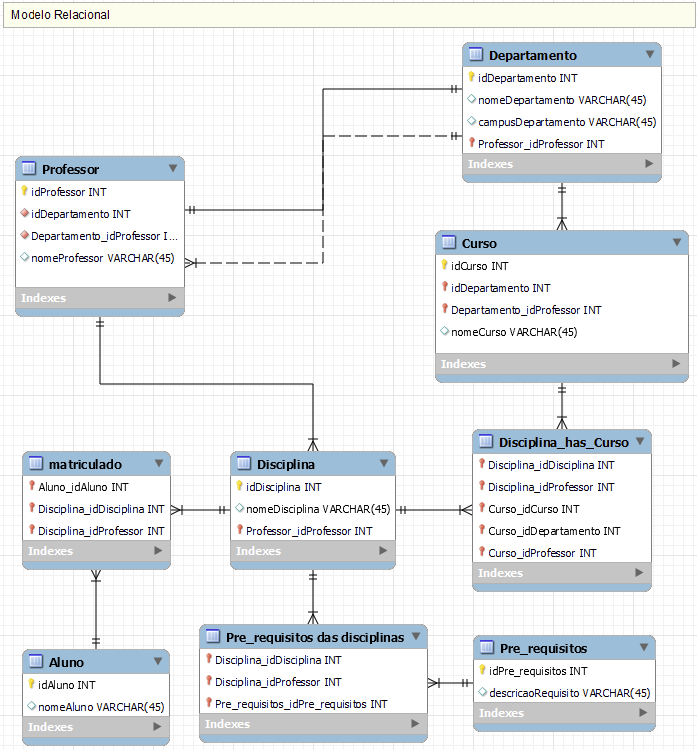
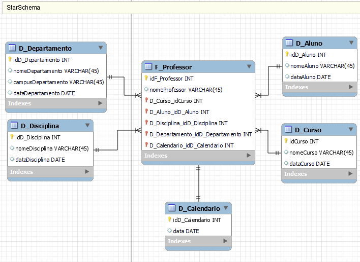

# StarSchema para Power BI 🌟

## Problema Proposto 🤔
Dado um esquema de banco de dados contendo as tabelas: **Professor** 👨‍🏫, **Departamento** 🏢, **Curso** 📚, **Disciplina** 📖 e **Aluno** 👩‍🎓, com as seguintes relações:
- **Professor** tem relação 1:N com **Departamento** e **Disciplina**.
- **Curso** tem relação N:M com **Disciplina**.
- **Disciplina** tem relação N:M com **Pre_Requisito** e **Aluno**.

O objetivo é converter este esquema tradicional em um Star Schema otimizado para análises no Power BI.

## Conversão para Star Schema 🛠️
Para efetuar a conversão para um modelo Star Schema, onde a tabela "Professor" é a tabela fato, siga os passos:

1. **Tabelas de Dimensão**: Identifique as tabelas "Departamento" 🏢, "Curso" 📚, "Disciplina" 📖 e "Aluno" 👩‍🎓 como dimensões.
2. **Tabela Fato**: Defina "Professor" 👨‍🏫 como a tabela fato central. Esta deve conter chaves estrangeiras que referenciam as dimensões.
3. **Relacionamentos**: Garanta que os relacionamentos entre a tabela fato e as dimensões sejam exclusivamente do tipo 1:M (um para muitos) 🔗.
4. **Medidas na Tabela Fato**: Inclua medidas agregadas, como contagens ou somas, que representem informações relevantes dos professores 📊.
5. **Implementação no Power BI**: Importe o modelo Star Schema para o Power BI. Utilize as dimensões e medidas para criar visualizações dinâmicas e insights valiosos 📈.

Lembre-se de que, no Power BI, as tabelas de dimensão:
*   Ajudam a filtrar e segmentar os dados, enquanto a tabela fato concentra as métricas chave para análise 🔍.
*   Simplifica as consultas: Reduz a necessidade de operações de join complexas, tornando as consultas mais rápidas e fáceis de entender.
*   Melhora o desempenho: A estrutura desnormalizada acelera o tempo de resposta para relatórios e análises.
*   Facilita a compreensão do usuário: A clareza do modelo ajuda os usuários finais a localizar e analisar os dados necessários com mais eficiência.

